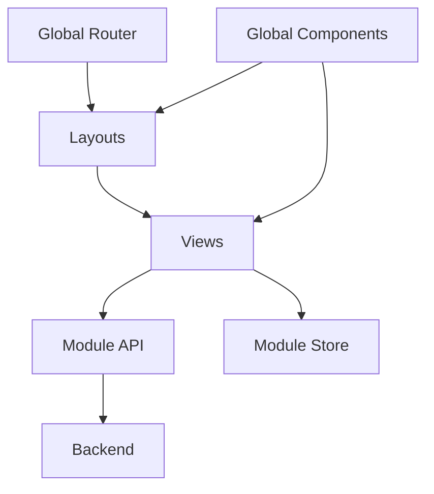

# Vue 3 Modular Application

This project is a **modular Vue 3 application** built with the Composition API using the `<script setup>` syntax and **PrimeVue** as the UI framework.

The architecture follows a **feature-based module structure** with a clear separation between **layouts**, **views**, **routing**, **state**, and **shared components**.

---

## Tech Stack

* **Vue 3**
* **Vue Router**
* **Pinia**
* **PrimeVue**
* **SCSS**
* **Vite**

---

## Project Structure

```
src/
├─ components/        # Global, reusable UI components
├─ config/            # App & library configuration
├─ layouts/           # Application layouts
├─ modules/           # Feature modules (auth, dashboard, settings, etc.)
├─ router/            # Global router setup
├─ services/          # Shared service logic (e.g. API helpers)
├─ stores/            # Global Pinia stores
├─ styles/            # Global styles, variables, themes
```

Layouts render views via `<RouterView />`, keeping **page composition explicit**.

---

## Layout System

Layouts live in `src/layouts/` and act as **page shells**.

Example layouts:

* `AuthLayout`
* `DashboardLayout`
* `SettingsLayout`
* `PublicLayout`

### Example Layout

```vue
<template>
  <Topbar />
  <main>
    <RouterView />
  </main>
</template>
```

---

## Feature Modules

Each module is **self-contained** under `src/modules/`:

```
src/modules/auth/
├─ api/        # API calls
├─ components/ # Module-specific components
├─ router/     # Module routes
├─ store/      # Module state (Pinia)
├─ views/      # Route views
```

This keeps features scalable and independent.

---

## Views

Views reside in module `views/` folders:

```
src/modules/auth/views/
```

Example:

```
ForgotPasswordView.vue
ResetPasswordView.vue
SignInView.vue
SignUpView.vue
VerifyEmailView.vue
VerifyEmailCallbackView.vue
```

Views coordinate **UI actions** and call **services/stores** — they contain minimal logic.

---

## Module Routing

Each module defines routes locally:

```js
import { SignUpView, SignInView, ForgotPasswordView, ResetPasswordView } from '../views';
import { AuthLayout } from '@/layouts/authLayout';

export default [
  {
    path: '/auth',
    component: AuthLayout,
    meta: { requiresGuest: true },
    children: [
      { path: 'signin', name: 'auth.signin', component: SignInView },
      { path: 'signup', name: 'auth.signup', component: SignUpView },
      { path: 'forgot-password', name: 'auth.forgot-password', component: ForgotPasswordView },
      { path: 'reset-password', name: 'auth.reset-password', component: ResetPasswordView },
    ],
  },
];
```

---

## Global Router

All module routes are composed globally:

```js
import authRoutes from '@/modules/auth/router';
import dashboardRoutes from '@/modules/dashboard/router';
import settingsRoutes from '@/modules/settings/router';
import homeRoutes from '@/modules/home/router';

const routes = [
  ...authRoutes,
  ...dashboardRoutes,
  ...settingsRoutes,
  ...homeRoutes,
];
```

Guards handle auth logic:

```js
router.beforeEach(async (to) => {
  const authStore = useAuthStore();
  if (!authStore.isInitialized) await authStore.init();
  if (to.meta.requiresAuth && !authStore.isAuthenticated) return { name: 'auth.signin' };
  if (to.meta.requiresGuest && authStore.isAuthenticated) return { name: 'dashboard' };
});
```

---

## Global Components

Located in `src/components/` and reused across layouts and modules.

Examples: `Topbar`, `Sidebar`, `UserMenu`, `NavToggle`, `BreadcrumbPath`, `Logo`.

---

## PrimeVue Configuration

Centralized in `src/config/primevue/`:

* Theme setup
* Environment configuration
* Global options

---

## Styling

Global styles in `src/styles/` include:

* CSS variables
* Typography & spacing scales
* Light/dark mode

Scoped SCSS is used for views and components.

---

## Architectural Principles

* Feature-first, module-based
* Layouts control page composition
* Views coordinate actions but stay thin
* Reusable components are global
* Explicit routing and store usage
* Backend-aligned, scalable

---

## Features

### Authentication

* Sign up
* Sign in
* Sign out
* Email verification
* Forgot/reset password

### Account & Profile

* Update name
* Update email (with confirmation)
* Update password
* Delete account

### Routing & Access Control

* Route-based layouts
* Auth/guest guards
* Automatic redirects

---

## Why This Architecture

* Each module owns its routes, views, API calls, and state
* No hidden coupling between modules
* Layouts are explicit via routing
* Easy to scale by adding modules
* Perfect match with backendBoilerplate

### Architecture Diagram



---

## Backend Compatibility

This frontend aligns with [backendBoilerplate](https://github.com/floatingbug/backendBoilerplate) and supports all corresponding endpoints.

---

## Self-Onboarding Guide

1. Create a new module under `src/modules/`
2. Add `views/`, `router/`, `api/`, `store/` (if needed)
3. Export routes from the module router
4. Register routes in global router
5. Choose or create a layout
6. Reuse global components
7. Keep views thin: **logic lives in services and stores**

---

## Summary

This architecture scales cleanly, keeps features isolated, and avoids spaghetti code.

---

## License

MIT
